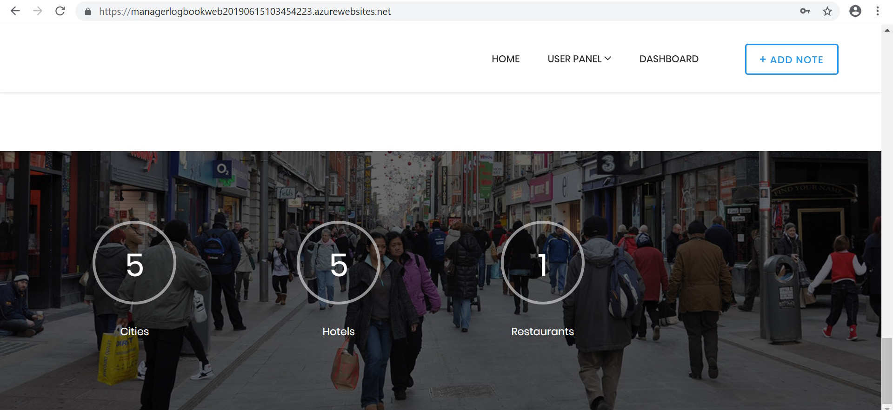
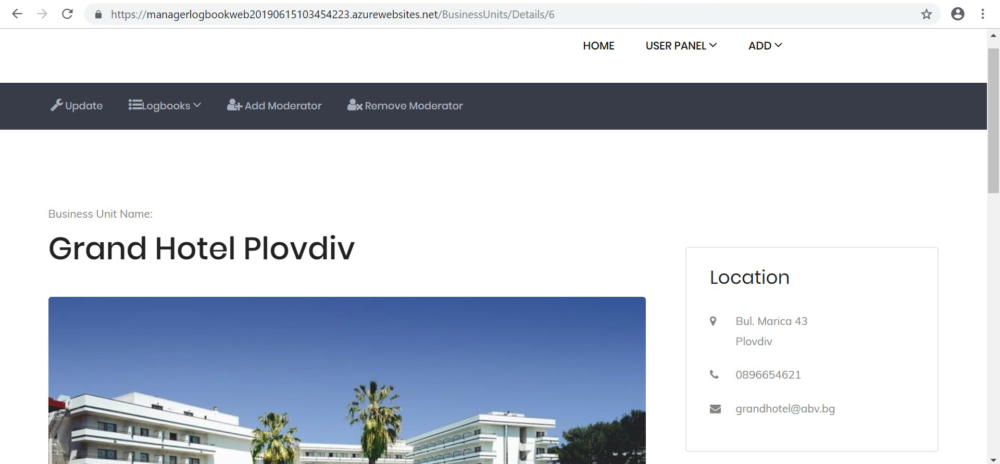
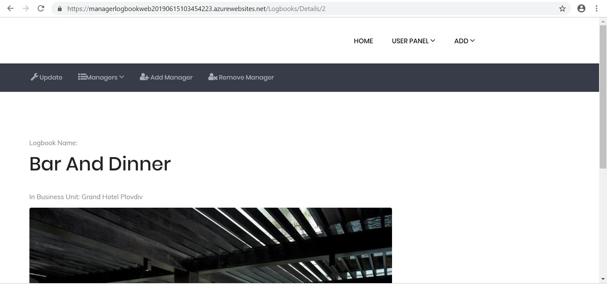
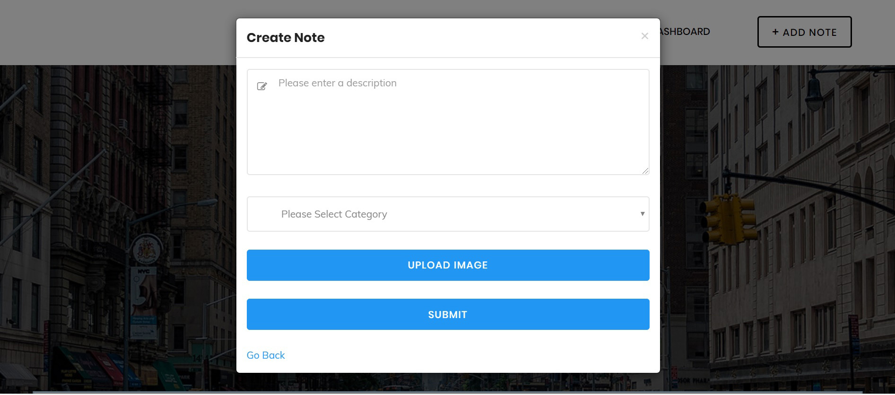
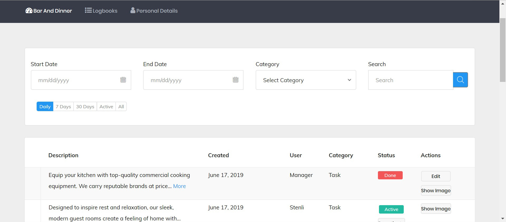
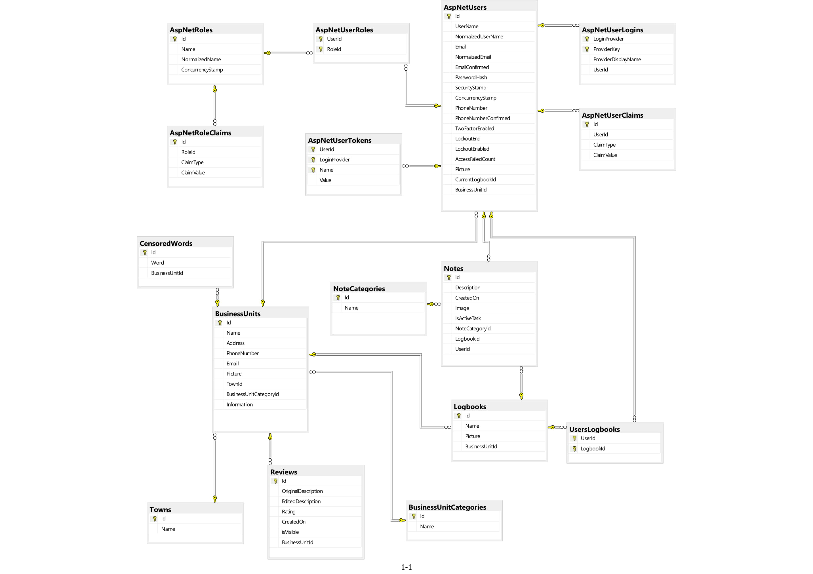

## Manager Logbook

----

#### Made by Team: Alpha Pro

- Stanil Dimitrov
- Peter Penev

#### Team leader
- Stanil Dimitrov

### Project Purpose
The web application allows Restaurant / Hotel customers to write comments about the service and see feedback from other people without any requirements to be registered users.                    
Moderators have access to the customer’s feedback posts and are able to filter out or censor posts that does not comply with common sense rules.
Managers of Restaurant / Hotel can take notes (logs) about the things happening on specific shift.     
System administrators can manage the accounts of managers and moderators. 
They are able to initialize new Business units and Logbooks.

#### Technologies and other important information

The General technologies used in the development of ManagerLogbook are the following:
  - ASP.NET Core 
  - ASP.NET Identity System with admin, manager and moderator area 
  - Entity Framework Core to access database (used Code First approach)
  - Microsoft SQL Server for data storage and Entity 
  - Razor for all of the apps pages
  - AJAX for dynamic representation
  - Bootstrap
  - Used caching for business unit categories, note categories, towns and error page 404
  - Used DTO (data transfer objects) to transfer data between different application layers
  - Created server-side pagination for the list of notes
  - Integration of application with a Continuous Integration server of Azure DevOps
  - Used GitHub advantages to work with branches durring development ot features
  - Used Azure DevOps to manage personal development tasks
  - Used Log4Net to handle unexpected exceptions in the application
  - 73 % Unit test code coverage of the business logic
  
#### Features
ManagerLogbook has public and private part.

The public part of the application is visible without any authentication. 
The following functionalities are available for customers:
 - access home page and perform a search via keyword and/or category and/or town location.
 - read information about business unit (hotel, restaurant,etc.) - short description, address, telephone, email, etc.
 - add and see comments with positive/negative service feedback. 
 
 - Search.jpg 
 
 - Statistics.jpg 
 
 
 
 The private part of the application is visible with authentication.
 Three areas are available: 
 
 I. Administration Part (only for Administrators).
 It supports the following functionalities:
 
 - create user account, business unit and/or logbook.
 - update business unit and/or logbook.
 - specify the access for each manager to certain logbook.
 - specify the access for each moderator to certain business unit.
 
 - BusinessUnitDetails.jpg 
 
 - LogbookDetails.jpg 
 
 II. Moderator part (available only for Moderators).
 It supports the following functionalities:
 
 - access customers' posts via dashboard section
 - edit customers' posts 
 - deactivate customers' posts
 
 III. Manager Part (available only for Managers).
 It supports the following functionalities:
 - add notes
 - edit personal notes
 - deactivate notes 
 - change the status of a note 
 - preview image (if it is available)
 - search for notes by given word
 - filter notes by category
 - filter notes by given date/date range
 - filter notes by current  day, last 7 days, last 30 days, or status
 - find information for active notes and total notes in given logbook

- CreateNote.jpg 

- ListNotes.jpg 

#### Database Diagram

- DbDiagram20190617.jpg 

#### Repository [repo]
#### Azure [azure]

[repo]: https://github.com/stanildimitrov/managerlogbook
[azure]: https://managerlogbookweb20190615103454223.azurewebsites.net/?fbclid=IwAR2NK81wGZhW-qtoO74LpaSn7eoIISDMKlaWv_QXPqL_mXIdng6zEK6tvlI

#### Manager Logbook

